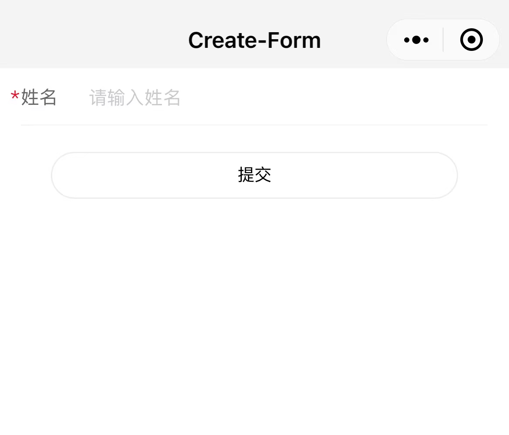
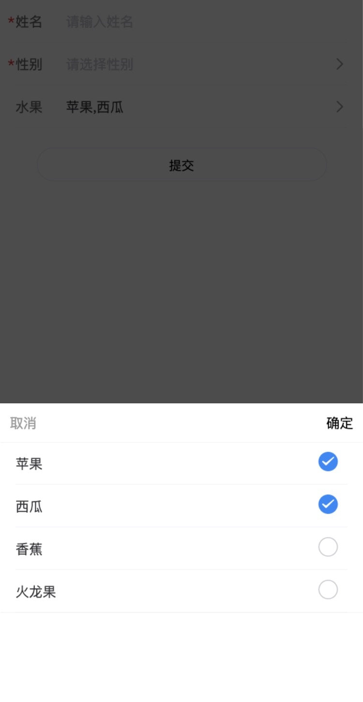

## 安装

```js{4}
npm i xc-components-custom -D 
// or
yarn add xc-components-custom -D 
// or 
pnpm add xc-components-custom -D 
```

## 构建

**app.json**
```js{4}
style: "v2" // 去掉
```
**project.config.json**
```js{4}

...
packNpmRelationList: [
    {
        "packageJsonPath": "./package.json",
        "miniprogramNpmDistDir": "./"  // TS环境下需要改为./miniprogram/
    }
]
...
```
```md
工具 --> 构建npm，之后生成 miniprogram_npm 文件夹即可
```

## 渲染一个input组件
**index.json**
```json{4}
{
    "usingComponents": {
        "xc-form":"/miniprogram_npm/xc-components-custom/xc-form/index"
    }
}
```
**index.html**
```html
<view>
    <xc-form
        dataSource="{{dataSource}}"
        btnText="提交"
        bind:confim="onSubmit"
    ></xc-form>
</view>
```
**index.js**
```js
Page({
    data: {
        dataSource: [
            {
                ele: 'input',
                label:'姓名',
                defaultValue:"",
                placeholder:"请输入姓名",
                required: true,
                disabled: false,
                toastMessage:'姓名不能为空',
                parameter:'name',
                titleWidth: 60,
                type: "text",
                maxLength: 10
            }
        ]
    },
    onSubmit(e){
        console.log('e:', e) // e.detail {name: ""} 拿到提交的结果
    }
})
```
**效果**




## 支持校验的input

**index.js**

```js
Page({
    data: {
        dataSource: [
            {
                ele: 'input',
                label:'手机号',
                defaultValue:"",
                placeholder:"请输入手机号",
                required: true,
                disabled: false,
                toastMessage:'手机号不能为空',
                parameter:'phone',
                titleWidth: 60,
                maxLength: 11,
                regexp: 1 // 如果校验身份证号，可传[2,7]18位和15位都合格才通过
            }
        ]
    }
})
```
## 渲染一个Picker
**index.js**
```js
Page({
    data: {
        dataSource: [
            {
                ele: 'picker',
                label:'性别',
                defaultValue:"",
                placeholder:"请选择性别",
                required: true,
                disabled: false,
                toastMessage:'性别不能为空',
                parameter:'gender',
                titleWidth: 30,
                columns: [
                    {
                        title: '男',
                        value: 1
                    },
                    {
                        title: "女",
                        value: 2
                    },
                    {
                        title: "保密",
                        value: 3
                    }
                ]
            }
        ]
    }
})
```
## 多选Picker
**index.js**
```js
Page({
    data: {
        dataSource: [
            {
                ele: 'picker-multiple',
                label:'水果',
                defaultValue:[],
                placeholder:"请选择水果",
                required: false,
                disabled: false,
                // toastMessage:'水果选择不能为空',
                parameter:'fruit',
                titleWidth: 30,
                columns: [
                    {
                        title: '苹果',
                        value: 1
                    },
                    {
                        title: "西瓜",
                        value: 2
                    },
                    {
                        title: "香蕉",
                        value: 3
                    },
                    {
                        title: "火龙果",
                        value: 4
                    }
                ]
            }
        ]
    }
})
```
**效果**




## Radio&checkbox
**index.js**
```js
Page({
    data: {
        dataSource: [
            {
              ele: 'radio', // 复选框将radio改为 checkbox
              parameter:'fruit',
              defaultValue: "",// 复选框将""改为[]
              label:'水果',
              columns: [
                {
                  title:'苹果',
                  value:1,
                },
                {
                  title:'草莓',
                  value:2,
                },
                {
                  title:'红龙果',
                  value:3,
                }
              ]
            }
        ]
    }
})
```

## 日期选择 calendar
**index.js**
```js
Page({
    data: {
        dataSource: [
            {
              ele: 'date',
              placeholder:'请选择脱发日期',
              parameter:'date',
              required: false,
              disabled:true,
              defaultValue:"",
              toastMessage: '选择脱发日期',
              label:'脱发日期',
              titleWidth: 60
            }
        ]
    }
})
```

## 上传图片
**index.js**
```js
Page({
    data: {
        dataSource: [
            {
              ele: 'upload',
              parameter:'avatar',
              required: false,
              defaultValue:[],
              toastMessage: '照片',
              label:'照片',
              titleWidth: 60,
              uploadUrl:'', // 上传地址
              maxCount: 3,
              maxSize: 2
            }
        ]
    }
})
```

## FormProps

| 字段名        | 描述       |  类型        | 默认值    | 例                                  |
|------------|:---------|-----------|--------|------------------------------------|
| dataSource | 数据源      |  `Array`   | `[]`     | `--`                               | 
| isBtnShow  | 是否显示按钮 |  `boolean` | `true` | `--`                               |
| btnStyle   | 按钮样式     |  `string`  | `""`     | `--`                               |
| btnText    | 按钮文字     |  `string`  | `提交`     | `--`                               |
| confim     | 提交事件     |  `event`   | `--`     | `bind:confirm`                     |
| id         | 组件实例     |`string`  | `--`     | `this.selectComponent('#id-name')` |

## FormInstance
| 字段名            | 描述     | 类型                | 例                             |
|----------------|:-------|-------------------|-------------------------------|
| setFieldsValue | 为字段设置值 | `Function` | `setFieldsValue({name:'章三'})` | 
| setFieldDisabled | 设置禁用 | `Function` | `setFieldDisabled(["name", true])` | 
## 校验规则
| 值 | 描述                                 | 
|---|:-----------------------------------| 
| 1 | `手机号校验`                            | 
| 2 | `18位身份证号码校验`                         | 
| 3 | `6-16位且必须包含数字、字母（大小写均可）和特殊符号`        | 
| 4 | `6-16位数字+字母（大小写均可）`                  | 
| 5 | `6-16位数字+字母（必须包含大小写）`                | 
| 6 | `6-16位数字+字母（必须包含大小写）加特殊符号`           |  
| 7 | `15位身份证号码校验`                         |  
| 8 | `6-16位纯数字 `                          |  
| 9 | `6-16位纯数字,纯字母或数字与字母的组合都可，但不能包含特殊符号`  |  

## dataSource Props
| 字段名          | 描述    | 可选项                                                | 默认值   |  
|--------------|-------|----------------------------------------------------|-------| 
| ele          | 组件类型  | `input` `picker` `picker-multiple` `radio` `upload` | --    | 
| label        | 标题    | `--`                                                 | `标题`  |
| placeholder  | 占位符   | `--`                                                  | `请输入` |
| required     | 是否必填  | `--`                                                  | `false` | 
| disabled     | 是否禁用  | `--`                                                  | `false` |
| toastMessage | 必填提示  | `--`                                                  | `必填`  |
| parameter    | 接口字段  | `--`                                                  | --    |
| titleWidth   | 标题宽度  | `--`                                                  | `60`  |
| type         | 输入类型  | `text` `idcard`                                    | `text` |
| maxLength    | 长度    | `--`                                                  | `200` |
| clearable    | 清除icon | `--`                                                  | `false` |
| defaultValue | 默认值  | `--`                                                   | ""      |

## dataSource Props - picker
| 字段名          | 描述  | 类型                                      | 默认值 |  
|--------------|-----|-----------------------------------------|----| 
| columns          | 数据源 | `Array<{title: string; value: number}>` | `[]` | 
## dataSource Props - multiple
| 字段名          | 描述  | 类型                                      | 默认值 |  
|--------------|-----|-----------------------------------------|----| 
| columns      | 数据源 | `Array<{title: string; value: number}>` | `[]` | 
| defaultValue | 默认值 | `Array<string>`                         | `[]` | 
## dataSource Props - radio
| 字段名          | 描述  | 类型                                      | 默认值  |  
|--------------|-----|-----------------------------------------|------| 
| columns      | 数据源 | `Array<{title: string; value: number}>` | `[]` | 
| defaultValue | 默认值 | `number`                                | `0`  | 
## dataSource Props - checkbox
| 字段名          | 描述  | 类型                                      | 默认值  |  
|--------------|-----|-----------------------------------------|------| 
| columns      | 数据源 | `Array<{title: string; value: number}>` | `[]` | 
| defaultValue | 默认值 | `Array<string>`                         | `[]` | 
## dataSource Props - upload
| 字段名       | 描述   | 类型                    | 默认值  |  
|-----------|------|-----------------------|------| 
| uploadUrl | 上传地址 | `string`              | `""` | 
| maxSize   | 大小限制 | `number`              | `2M` | 
| maxCount  | 数量限制 | `number`              | `5张` | 
| defaultValue  | 默认值  | `Array<{url: string}>` | `[]` | 

[//]: # ()
[//]: # (::: info)

[//]: # (This is an info box.)

[//]: # (:::)

[//]: # ()
[//]: # (::: tip)

[//]: # (This is a tip.)

[//]: # (:::)

[//]: # ()
[//]: # (::: warning)

[//]: # (This is a warning.)

[//]: # (:::)

[//]: # ()
[//]: # (::: danger)

[//]: # (This is a dangerous warning.)

[//]: # (:::)

[//]: # ()
[//]: # (::: details)

[//]: # (This is a details block.)

[//]: # (:::)

[//]: # ()
[//]: # (## More)

[//]: # ()
[//]: # (Check out the documentation for the [full list of markdown extensions]&#40;https://vitepress.dev/guide/markdown&#41;.)
